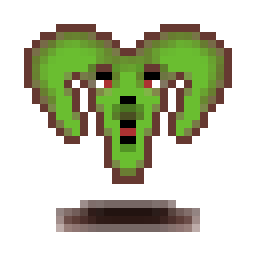

<a name="readme-top"></a>
<!-- PROJECT SHIELDS -->
<!--
*** I'm using markdown "reference style" links for readability.
*** Reference links are enclosed in brackets [ ] instead of parentheses ( ).
*** See the bottom of this document for the declaration of the reference variables
*** for contributors-url, forks-url, etc. This is an optional, concise syntax you may use.
*** https://www.markdownguide.org/basic-syntax/#reference-style-links
-->

[![Contributors][contributors-shield]][contributors-url]
[![Forks][forks-shield]][forks-url]
[![Stargazers][stars-shield]][stars-url]
[![Issues][issues-shield]][issues-url]
[![MIT License][license-shield]][license-url]

<!-- PROJECT LOGO -->
<br />
<div align="center">
  <a href="https://github.com/VoR-gamedev/Masterwatch/tree/master/GitHub/images/logo.png">
    
  </a>

  <br />

<a href="https://github.com/VoR-gamedev/Masterwatch/tree/master/GitHub/images/GameName.png">
    
  </a>

  <p align="center">
    Game is in early development, expect changes!
    </p>
    <br />
    
    
    
    
    
    <p>
    <a href="https://github.com/VoR-gamedev/Masterwatch/issues">Report Bug</a>
    <p>or</p>
    <a href="https://github.com/VoR-gamedev/Masterwatch/issues">Ask for feature</a>
    </p>
</div>


<!-- TABLE OF CONTENTS -->
<details>
  <summary>Table of Contents</summary>
  <ol>
    <li>
      <a href="#about-the-project">About The Project</a>
      <ul>
        <li><a href="#built-with">Built With</a></li>
      </ul>
    </li>
    <li>
      <a href="#getting-started">Getting Started</a>
      <ul>
        <li><a href="#prerequisites">Prerequisites</a></li>
        <li><a href="#installation">Installation</a></li>
      </ul>
    </li>
    <li><a href="#usage">Usage</a></li>
    <li><a href="#roadmap">Roadmap</a></li>
    <li><a href="#contributing">Contributing</a></li>
    <li><a href="#license">License</a></li>
    <li><a href="#contact">Contact</a></li>
    <li><a href="#acknowledgments">Acknowledgments</a></li>
  </ol>
</details>


<!-- ABOUT THE PROJECT -->
## About The Project

[![Masterwatch Screen Shot][game-screenshot]](https://github.com/VoR-gamedev/Masterwatch/tree/master/GitHub/images/screenshot.png)

This game was started because it reminds me of an old browser-based game and I had a hinkering to do some programming.

### Built With

* 
* 
* 
* 

<!-- GETTING STARTED -->
## Getting Started

To get a local copy of the source code up and running follow these simple steps:
1. Get [Microsoft Visual Studio](https://visualstudio.microsoft.com/) or your IDE of choice *(Built with VS)*.
2. Clone this repository.
3. Run the Masterwatch.sln file located at the root directory.
4. The project should open in VS.
5. Add prerequisites to VS studio or your IDE of choice *(Explained below)*.
6. Build and run the project to test it.

### Prerequisites (TBD)

These are the required libraries / frameworks for the project.
* npm
  ```sh
  npm install npm@latest -g
  ```

### Installation

Installation file will be available once development has reached some point of completion and gameplay is available.  
Until then updates will be frequent and gameplay may change a lot of times.

<!-- USAGE EXAMPLES -->
## Usage (TBD)

Use this space to show useful examples of how a project can be used. Additional screenshots, code examples and demos work well in this space. You may also link to more resources.

_For more examples, please refer to the [Documentation](https://example.com)_


<!-- ROADMAP -->
## Roadmap

- [ ] Basic gameplay
    - [ ] Village
    - [ ] Player base
        - [ ] Garden
        - [ ] Storage
        - [ ] Upgrades for the base
    - [ ] First areas:
        - [ ] Fields
        - [ ] Forest
        - [ ] Mines
        - [ ] River
- [ ] Add first 5 tiers:
    - [ ] Gathered / Mined / etc. materials
    - [ ] Refined materials
    - [ ] Crafted materials / items
- [ ] Character customization
- [ ] Races:
    - [ ] Human
    - [ ] Elf
    - [ ] Dwarf
    - [ ] Undead
    - [ ] Merfolk
    - [ ] Avian
    - [ ] Gnome
    - [ ] Orc
    - More may be added later.
- [ ] Classes:
    - [ ] Warrior
    - [ ] Archer
    - [ ] Mage
    - More may be added later.
- [ ] GUI update

That's it for now, will be updated with more planned changes later on.

Development progress can be explored in detail inside the [Change log](https://github.com/VoR-gamedev/Masterwatch/blob/master/CHANGELOG.md).

See the [open issues](https://github.com/VoR-gamedev/Masterwatch/issues) for a full list of proposed features (and known issues).

<p align="right">(<a href="#readme-top">back to top</a>)</p>

<!-- CONTRIBUTING -->
## Contributing

Contributions are what make the open source community such an amazing place to learn, inspire, and create. Any contributions you make are **greatly appreciated**.

If you have a suggestion that would make this better, please fork the repo and create a pull request. You can also simply open an issue with the tag "enhancement".
Don't forget to give the project a star! Thanks again!

1. Fork the Project
2. Create your Feature Branch (`git checkout -b feature/AmazingFeature`)
3. Commit your Changes (`git commit -m 'Add some AmazingFeature'`)
4. Push to the Branch (`git push origin feature/AmazingFeature`)
5. Open a Pull Request

Contributions are also welcome in [Discord](https://discord.gg/tFhUB72XVH)!

<!-- LICENSE -->
## License

Distributed under the MIT License. See `LICENSE.txt` [License](https://github.com/VoR-gamedev/Masterwatch/blob/master/LICENSE.txt) for more information.

<!-- CONTACT -->
## Contact

Voice of Reason - [Discord server](https://discord.gg/tFhUB72XVH) - *Discord nickname:* **.voiceofreason**

Project Link: [GitHub](https://github.com/VoR-gamedev/Masterwatch)

<!-- ACKNOWLEDGMENTS -->
## Acknowledgments

* [Monogame](https://www.monogame.net/) - Game framework
* [GeonBit.UI](https://github.com/RonenNess/GeonBit.UI) - Slightly outdated but works for GUI
* [Aseprite](https://www.aseprite.org/) - Asset drawing tool

<p align="right">(<a href="#readme-top">back to top</a>)</p>

<!-- MARKDOWN LINKS & IMAGES -->
<!-- https://www.markdownguide.org/basic-syntax/#reference-style-links -->
<!-- Shields -->
[contributors-shield]: https://img.shields.io/github/contributors/VoR-gamedev/Masterwatch.svg?style=for-the-badge
[contributors-url]: https://github.com/VoR-gamedev/Masterwatch/graphs/contributors
[forks-shield]: https://img.shields.io/github/forks/VoR-gamedev/Masterwatch.svg?style=for-the-badge
[forks-url]: https://github.com/VoR-gamedev/Masterwatch/network/members
[stars-shield]: https://img.shields.io/github/stars/VoR-gamedev/Masterwatch.svg?style=for-the-badge
[stars-url]: https://github.com/VoR-gamedev/Masterwatch/stargazers
[issues-shield]: https://img.shields.io/github/issues/VoR-gamedev/Masterwatch.svg?style=for-the-badge
[issues-url]: https://github.com/VoR-gamedev/Masterwatch/issues
[license-shield]: https://img.shields.io/github/license/VoR-gamedev/Masterwatch.svg?style=for-the-badge
[license-url]: https://github.com/VoR-gamedev/Masterwatch/blob/master/LICENSE.txt
<!-- Other reference style links -->
[game-screenshot]: GitHub/images/screenshot.png